# K-Tour ID — AI Tourist Trust Wallet 🇰🇷

> 내·외국인 관광객을 위한 **AI 기반 디지털 관광 신뢰지갑**.
> 모바일 신분증·여권 DID로 신원을 확인하고, **K-Pass Capsule**(디지털 관광 주민증)을 발급해
> 원화 스테이블코인 결제·교통·쇼핑·혜택을 하나로 잇습니다.

Built for the **2026 블록체인 & AI 해커톤** (한국디지털인증협회 · OmniOne / Open DID) — Track 2 (MVP 개발·시연).
Mandatory: **Mobile ID(모바일 신분증)** · Bonus: **Open DID (+5%)** · **OmniOne Chain (+5%)**.

- 🔗 **Live demo:** _(Vercel 배포 후 추가)_
- 📄 **Proposal:** [`docs/`](./docs) (제출 PDF)
- 🧩 **App:** [`kstayble-fe/`](./kstayble-fe) (Next.js)

---

## What it is

Foreign tourists in Korea hit structural walls — fragmented payments, Korean-only super-apps,
no domestic phone number, identity-verification barriers. Domestic travelers' local benefits,
coupons and activity history are scattered across channels.

**K-Tour ID** issues every visitor a single verifiable credential — the **K-Pass Capsule** — that
standardizes *service permission* (stay period, payment limit, eligible services, benefits) regardless
of how the person was verified:

- **내국인 (Korean)** → Mobile ID / OmniOne CX
- **외국인 관광객 (Foreign visitor)** → Passport DID + eKYC
- **장기체류 외국인 (Long-stay)** → Foreigner ID adapter

One pass then unlocks **transit · food · shopping · reservation · benefits**, paid in a **KRW
stablecoin** wallet, with every issuance/payment/settlement logged as a **hash** on the **OmniOne
Chain** (originals stay off-chain — *Privacy Edge*), and an **AI Benefit Router** that recommends
offers and converts leftover KRW into coupons/vouchers to drive revisits.

---

## Screens / Demo flow

```
Onboarding (언어 선택 → 가치 프리뷰 → 신원 방식 → 스캔 → 본인확인(초상) → 도장 발급 → 완료)
   → Home (지갑·퀵액션·파트너·서비스)
   → Wallet (잔액·예산·거래 = OmniOne 이벤트)
   → K-Pass (자격 정보·Privacy Edge·체인 이벤트 로그)
   → AI Guide (맞춤 혜택 + 챗봇)
   → Profile / Alerts
```

| Route | Screen |
|---|---|
| `/onboarding` | 7-step credential-issuance ceremony (language-first, value preview, portrait confirm, dojang stamp) |
| `/` | Home — KRW wallet, quick actions, real partner brands, services |
| `/wallet` | KRW stable wallet — balance(만원), trip budget, spend sparkline, transactions (OmniOne events) |
| `/pass` | K-Pass Capsule (Open DID VC) detail — credential, Privacy Edge, OmniOne Chain event log |
| `/ai` | AI Benefit Router — recommendations + chatbot |
| `/profile`, `/alerts` | identity, settings, notifications |

---

## Architecture

The product follows the proposal (see [`docs/`](./docs)): identity is standardized into a Verifiable
Credential, payments settle in a KRW stablecoin, and trust events are anchored on-chain.

```mermaid
flowchart LR
  subgraph Entry["1 · Identity Entry"]
    A1[Mobile ID / OmniOne CX<br/>내국인]
    A2[Passport DID + eKYC<br/>외국인]
    A3[Foreigner ID Adapter<br/>장기체류]
  end
  subgraph Gateway["2 · Trust Gateway"]
    B1[Identity Adapter]
    B2[DID / VC Manager<br/>Open DID]
    B3[Trust Profile Builder]
  end
  subgraph Core["3 · K-Tour ID Core"]
    C1[K-Pass Capsule Issuer<br/>VC: 체류·한도·혜택]
    C2[Payment & Policy Router]
    C3[KRW Stable Wallet]
    C4[AI Benefit Router]
  end
  subgraph Svc["4 · Service & Settlement"]
    D1[교통 · 쇼핑 · 배달 · 예약 · 혜택]
    D2[Coupon / Voucher · Partner Settlement]
  end
  Entry --> Gateway --> Core --> Svc
  Core -. "hash only" .-> Chain[(OmniOne Chain<br/>Event Log)]
  Svc -. "hash only" .-> Chain
```



**OmniOne Chain events:** `KPassIssued · WalletLinked · PaymentAuthorized · VoucherIssued ·
VoucherRedeemed · PartnerSettlementLogged` — only event hashes are written on-chain; personal data and
payment originals remain off-chain (**Privacy Edge**: selective disclosure, ZKP-ready).

### RaonSecure / OmniOne — where the two solutions plug in

라온시큐어 OmniOne의 두 솔루션(**Open DID**, **OmniOne Chain**)과 필수 요소 **모바일 신분증(OmniOne CX)** 은
이 아키텍처의 **세 개 코드 seam**에 정확히 들어갑니다 — 데모는 같은 인터페이스에 mock을, 결선엔 실제 SDK 어댑터를 교체만 합니다:

| 통합 지점 (코드 seam) | OmniOne 솔루션 | 역할 | 해커톤 |
|---|---|---|---|
| `IdentityService.verify()` | **Mobile ID / OmniOne CX** | 본인확인 (내국인=모바일 신분증 · 외국인=여권 eKYC) | 필수 |
| `CapsuleService.issue()` · VP 검증 | **OmniOne Open DID** | K-Pass Capsule(VC) 발급·검증 · Selective Disclosure | +5% |
| `ChainService.log()` | **OmniOne Chain** | 발급·결제·정산 이벤트를 **해시로** 기록 (감사·추적) | +5% |

> 본인확인(CX) → Open DID로 K-Pass Capsule(VC) 발급 → 원화 결제 → OmniOne Chain에 이벤트 해시 기록 →
> 가맹점이 **Open DID VP**로 자격 검증 → 정산. 신원 소스가 달라도 서비스 권한은 K-Pass로 표준화됩니다.

전체 시퀀스 다이어그램(① 발급 ② 결제 ③ **가맹점 VP 검증**)과 Privacy Edge on/off-chain 표는
**[`kstayble-fe/docs/ARCHITECTURE.md`](./kstayble-fe/docs/ARCHITECTURE.md)** 에 있습니다.

### How the demo maps to the spec

This repo is a **clickable Phase-0 demo**. Services are **mocked behind interfaces** so the UI is
real and end-to-end, and the real OmniOne / Open DID / payment adapters drop in for the finals
**without touching any screen**:

```
lib/services/
  interfaces.ts   ← IdentityService · CapsuleService · ChainService · WalletService · BenefitService
  mock.ts         ← demo implementations (deterministic, no backend)
  index.ts        ← DEMO_MODE swaps mock <-> real adapters (one line per service)
```

- **AI chat** is mocked today; a drop-in **Claude** route handler is wired and documented in
  [`kstayble-fe/docs/AI_INTEGRATION.md`](./kstayble-fe/docs/AI_INTEGRATION.md) — add `ANTHROPIC_API_KEY` and flip a flag.
- `kstayble-contracts/` holds an **earlier on-chain experiment** (a KRW stablecoin `forKRW` gated by a
  soulbound `ForeignerSBT`) — illustrative of the verified-holder + KRW-token concept; the current
  product targets OmniOne / Open DID.

---

## Tech stack

- **Next.js 16** (App Router) · **React 19** · **TypeScript**
- **Tailwind CSS v4** · shadcn/ui primitives · lucide icons
- Client state via a typed `AppProvider`; i18n (KO default / EN) via a tiny `LangProvider` + dictionary
- No backend required for the demo (one optional serverless route for live AI)

## Design language

Korean-heritage, deliberately not a generic template: **한지(paper)** ground · **먹(ink)** wallet card ·
**인주 도장(dojang seal-red)** brand · **단청 navy + 금박 gold** credential. The 信 (trust) dojang is
the brand mark and the credential verification stamp.

## Project structure

```
kstayble/
├─ kstayble-fe/            # Next.js app (deploy this)
│  ├─ app/                 # routes: /, onboarding, wallet, pass, ai, profile, alerts, api/chat
│  ├─ components/app/      # PhoneFrame, Seal, KPassCard, WalletCard, BrandMark, modals, sheet …
│  ├─ lib/                 # types, services (interface+mock), store, i18n, brands, format
│  └─ public/              # partner logos, portraits, assets
├─ kstayble-contracts/     # Solidity (earlier KRW-stablecoin + SBT experiment)
├─ docs/                   # proposal PDF
└─ README.md
```

## Getting started

```bash
cd kstayble-fe
pnpm install
pnpm dev            # http://localhost:3000
```

## Deploy (Vercel)

Deploy the **`kstayble-fe`** subdirectory:

1. Import this repo into Vercel.
2. **Root Directory:** `kstayble-fe` · **Framework:** Next.js (auto).
3. Build `next build`, install `pnpm install` (auto-detected). No env vars required for the demo
   (optionally set `ANTHROPIC_API_KEY` + `NEXT_PUBLIC_DEMO_MODE=false` to enable live AI chat).

## Roadmap (Finals)

- Real adapters: Mobile ID / OmniOne CX, Passport eKYC, **Open DID VC issuance**, **OmniOne Chain** logging, KRW stable-wallet payments
- Emit all 6 chain events end-to-end (incl. `VoucherRedeemed`, `PartnerSettlementLogged`)
- AI Benefit Router: leftover-KRW → coupon/NFT conversion, anomaly detection
- Partner/merchant side: VP verification + settlement dashboard
- Selective-disclosure (ZKP) presentation flow

## Team — Hope & Woogieboogie

- **김해인 (Hope)** — 대표 / 사업개발·마케팅
- **이재욱 (Woogieboogie)** — PO / Development
- **이동우** — Global Biz

---

<sub>Demo build. Partner brand logos denote integration partners and identity portraits are sample
images; not affiliated with the named brands.</sub>
