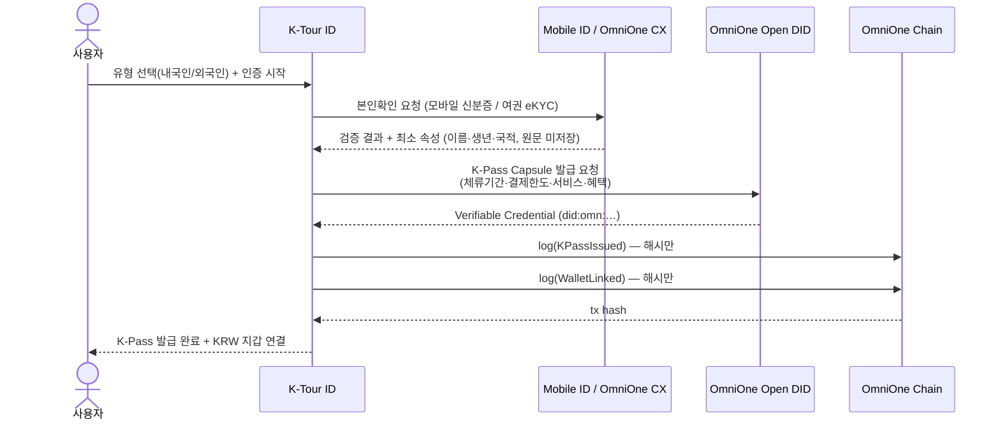
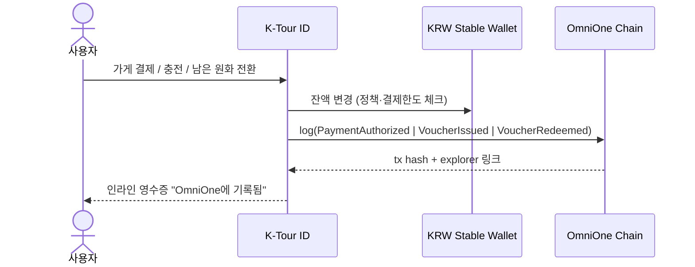
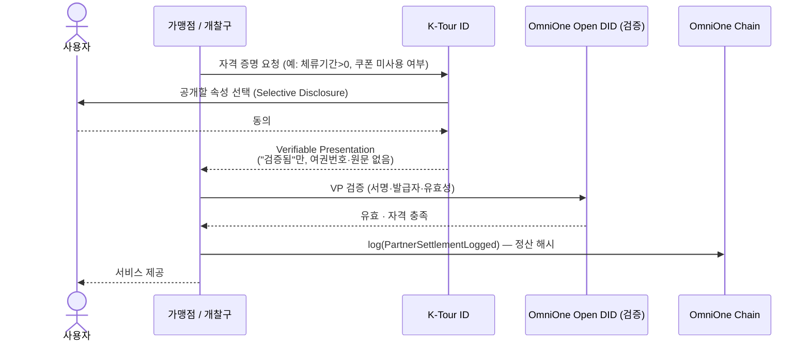

# K-Tour ID × RaonSecure(OmniOne) — 기술 통합 설명서

발표용. **라온시큐어 OmniOne의 두 솔루션(Open DID, OmniOne Chain) + 필수 요소 모바일 신분증(OmniOne CX)** 이
K-Tour ID 아키텍처의 **3개 지점**에 정확히 꽂힙니다. 데모는 동일한 서비스 인터페이스에 mock을 끼운 것이고,
결선에는 그 자리에 실제 OmniOne SDK 어댑터를 교체만 하면 됩니다.

| 통합 지점 (코드 seam) | 라온시큐어 / OmniOne 솔루션 | 역할 | 해커톤 |
|---|---|---|---|
| `IdentityService.verify()` | **Mobile ID / OmniOne CX** | 본인확인 (내국인=모바일 신분증, 외국인=여권 eKYC) | 필수 |
| `CapsuleService.issue()` + VP 검증 | **OmniOne Open DID** | K-Pass Capsule(VC) 발급·검증, Selective Disclosure | 가점 +5% |
| `ChainService.log()` | **OmniOne Chain** | 발급·결제·정산 이벤트를 **해시로** 기록 (감사·추적) | 가점 +5% |

> 한 문장: **모바일 신분증/여권으로 본인확인(CX) → Open DID로 K-Pass Capsule 발급(VC) → 원화 결제 →
> OmniOne Chain에 이벤트 해시 기록 → 가맹점이 Open DID VP로 자격 검증 → 정산.**
> 신원 소스는 달라도(내·외국인) 서비스 권한은 K-Pass로 표준화됩니다.

---

## 1) 발급 — 본인확인 → VC 발급 → 체인 기록

`온보딩`에서 일어나는 흐름. CX·Open DID·OmniOne Chain 세 솔루션이 모두 등장합니다.



- **CX (필수):** 정부 모바일 신분증 제시·검증. 외국인은 여권 eKYC, 장기체류는 외국인등록증 어댑터 — 모두 같은 `IdentityService` 인터페이스.
- **Open DID (+5%):** 확인된 신원으로 DID 생성 + K-Pass Capsule을 **VC**로 발급.
- **OmniOne Chain (+5%):** `KPassIssued`, `WalletLinked` 이벤트를 해시로 기록.

---

## 2) 사용 — 결제 / 충전 / 남은 원화 전환

`지갑`·`홈`·`코파일럿`에서의 거래. 모든 거래는 OmniOne Chain에 이벤트로 남습니다.



- `pay()` → **PaymentAuthorized**, `topUp()` → **VoucherIssued**, `convertLeftover()` → **VoucherRedeemed**.
- 결제한도(K-Pass의 `paymentLimitKRW`)는 정책 라우터에서 검증 — VC의 속성이 실제 정책으로 작동.

---

## 3) 검증·정산 — 가맹점이 K-Pass를 검증 (Open DID VP) · Privacy Edge

결선 시연 포인트. 가맹점/개찰구가 **VP(Verifiable Presentation)** 로 자격만 확인하고, 원문은 절대 받지 않습니다.



**Privacy Edge — 온체인 vs 오프체인**

| 위치 | 내용 |
|---|---|
| **On-chain (OmniOne Chain)** | 이벤트 **해시만**: `KPassIssued · WalletLinked · PaymentAuthorized · VoucherIssued · VoucherRedeemed · PartnerSettlementLogged` |
| **Off-chain** | 여권번호·개인정보·결제 원문·사진 (기기/발급자 보관) |

→ 국적·체류기간·쿠폰 중복 여부를 **원문 없이** 증명(Selective Disclosure, ZKP-ready 설계).

---

## 데모 ↔ 실제 스왑 (코드 관점)

```
lib/services/
  interfaces.ts   IdentityService · CapsuleService · ChainService · WalletService · BenefitService
  mock.ts         데모용 구현 (현재 동작)
  index.ts        DEMO_MODE 로 mock ⇄ real 어댑터 1줄 교체
```

| 인터페이스 | 결선 real 어댑터 |
|---|---|
| `IdentityService` | OmniOne CX SDK (모바일 신분증 / eKYC) |
| `CapsuleService` | OmniOne Open DID — VC 발급/VP 검증 API |
| `ChainService` | OmniOne Chain — 트랜잭션 기록 + explorer |

화면 코드는 그대로. **"우리 데모의 인터페이스가 곧 OmniOne 세 솔루션의 자리"** 가 핵심 메시지입니다.

---

## Verified Connect (확장) — 신뢰 기반 교류

K-Pass(VC)는 결제·서비스 권한뿐 아니라 **사람 간 신뢰**의 근거가 됩니다. `함께하기`의 모든 사용자·호스트는
DID 검증(🇰🇷 모바일 신분증 / 🌏 여권 DID)을 거쳐 "검증됨" 배지를 가지며, VP로 가이드/튜터 자격을 증명할 수 있습니다.
헬로톡류의 익명·사칭 문제를 신원 인프라로 해소하는, OmniOne 위에서만 가능한 차별점입니다.
